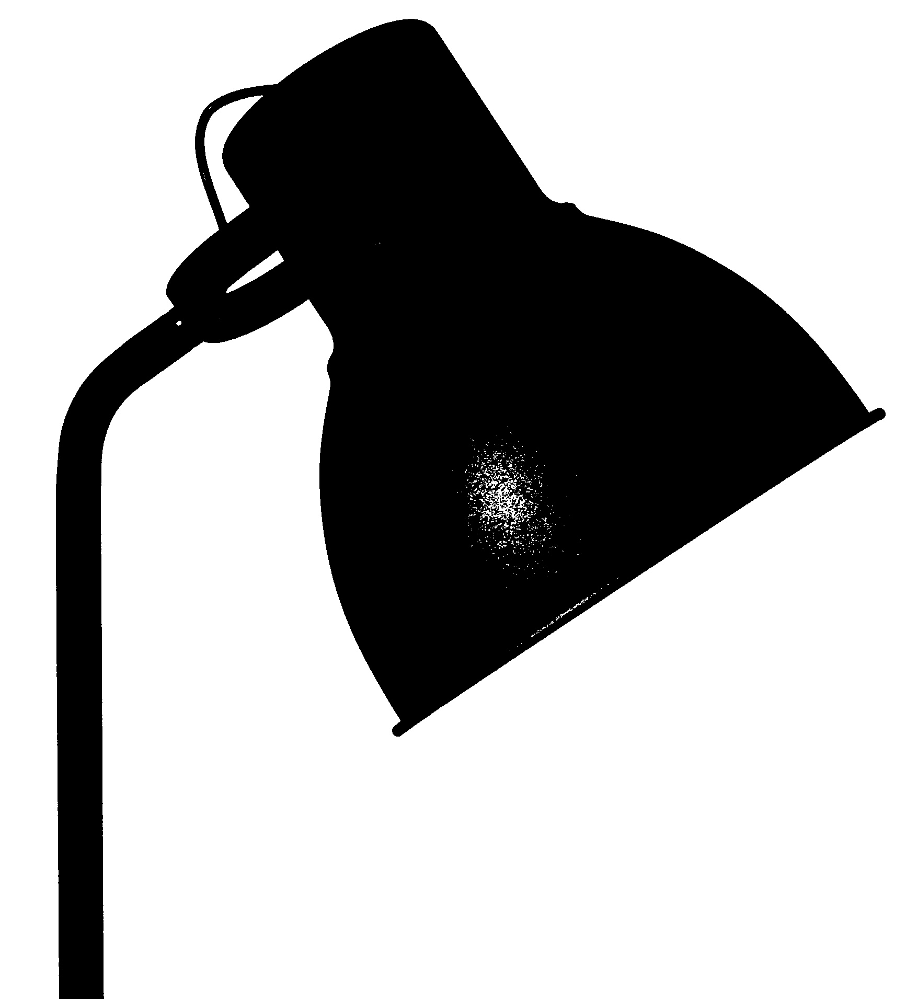
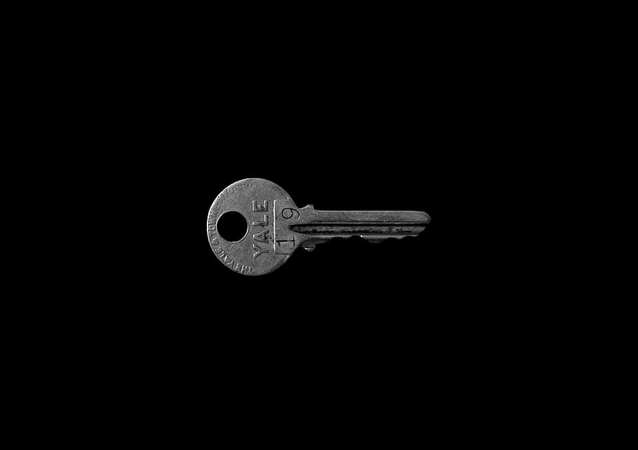
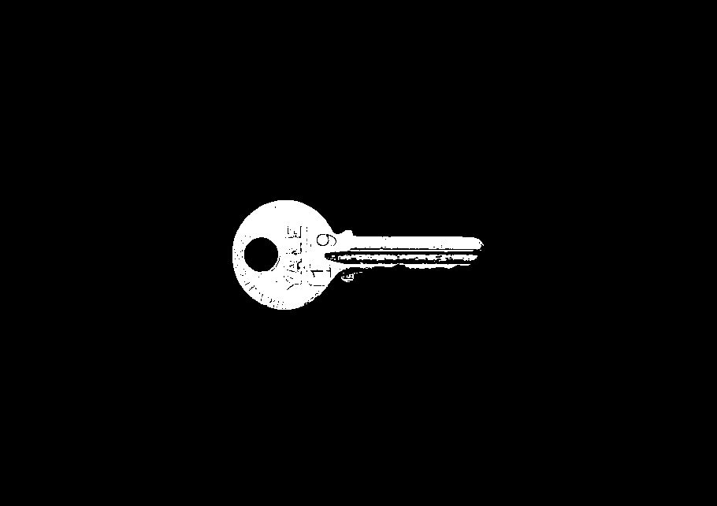

# Threshold-based Image Segmentation

A Python script for image segmentation implemented based on the inter-means algorithm, with a primary focus on NumPy for efficient data manipulation. OpenCV is used only for image loading and saving.

## Results

| **Image Number**  | **Original Image**                            | **Segmented Image**                                      |
|-------------------|-----------------------------------------------|----------------------------------------------------------|
| 01                |  |  |
| 02                |  |  |
